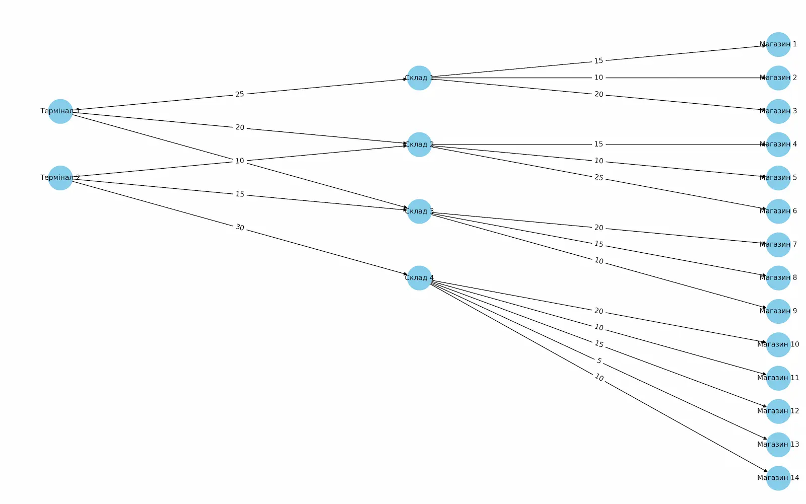

## task 1 - Алгоритм Едмондса-Карпа

| Термінал   | Магазин    | Фактичний потік |
| ---------- | ---------- | --------------- |
| Термінал 1 | Магазин 1  | 15              |
| Термінал 1 | Магазин 2  | 10              |
| Термінал 1 | Магазин 3  | 20              |
| Термінал 1 | Магазин 4  | 15              |
| Термінал 1 | Магазин 5  | 10              |
| Термінал 1 | Магазин 6  | 20              |
| Термінал 1 | Магазин 7  | 15              |
| Термінал 1 | Магазин 8  | 15              |
| Термінал 1 | Магазин 9  | 10              |
| Термінал 2 | Магазин 4  | 10              |
| Термінал 2 | Магазин 5  | 10              |
| Термінал 2 | Магазин 6  | 10              |
| Термінал 2 | Магазин 7  | 15              |
| Термінал 2 | Магазин 8  | 15              |
| Термінал 2 | Магазин 9  | 10              |
| Термінал 2 | Магазин 10 | 20              |
| Термінал 2 | Магазин 11 | 10              |
| Термінал 2 | Магазин 12 | 15              |
| Термінал 2 | Магазин 13 | 5               |
| Термінал 2 | Магазин 14 | 10              |

1. Термінали, які забезпечують найбільший потік товарів до магазинів:

- потік Термінал 1: 130 одиниць.
- потік Термінал 2: 130 одиниць.

2. Маршрути з найменшою пропускною здатністю:

- Склад 4 -> Магазин 13 має найменшу пропускну здатність — 5 одиниць.

3. Магазини, які отримали найменше товарів:

- Магазин 13 отримує 5 одиниць - мінімальне значення.
- Для збільшення постачання до Магазину 13 треба підвищити пропускну здатність Склад 4 -> Магазин 13.

4. Вузькі місця:

- Вузьким місцем є маршрут Склад 4 -> Магазин 13 із пропускною здатністю 5 одиниць.

## task 2 - BTree

### results:

Total range_query time for OOBTree: 1.113326 seconds

Total range_query time for Dict: 0.325205 seconds
